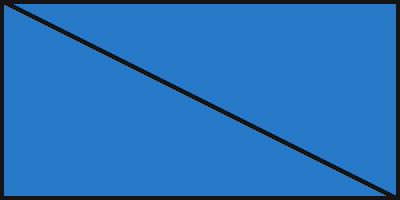
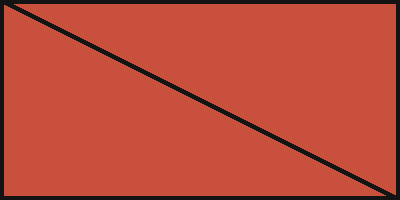
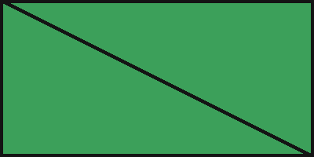
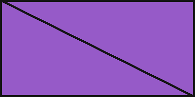
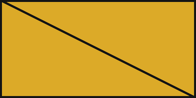
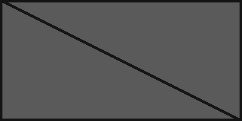
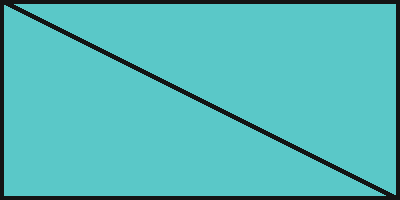
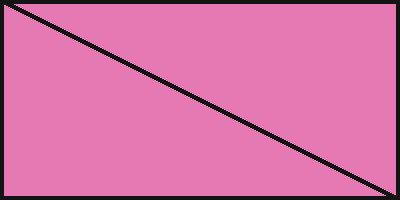

# Polish

An empty fenced block:

```
```

A list with code at three depths:

- First item

  ```swift
  let one = 1
  ```

  - Second level

    ```
    two levels in
    ```

    - Third level

      ```python
      three = "levels"
      ```

> A quote with code:
>
> ```
> quoted code
> ```
>
> - a list in the quote
>
>   ```
>   code in a list in a quote
>   ```

- # A heading in a list item
- ## A smaller heading in a list item
- Plain item for comparison

Pictures by declared resolution (each is 400 by 200 pixels):

















A picture wider than the column:


Footnote[^n] and the end.

[^n]: The footnote.
