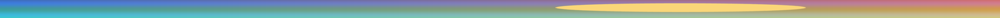
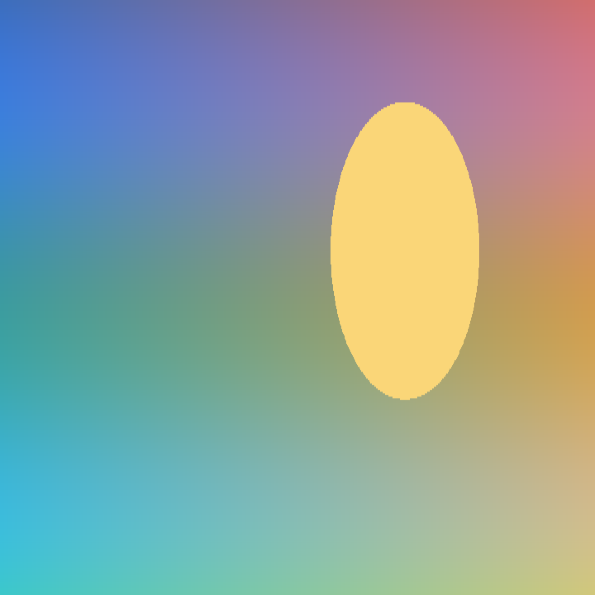

# Preview edge cases

Every kind of picture a document can name, each on its own line, so the editor (Live mode) and the preview can be compared one for one.







## Links

[web](https://example.com/x), [mail](mailto:someone@example.com), [sibling](other.md), [one up](../up.md), [a fragment](#a-table-and-code), [an application](/Applications/Calculator.app), [script](javascript:alert(1)), www.example.org.

## Raw HTML that must do nothing

<script>document.body.setAttribute('data-ran', 'yes')</script>

<iframe src="http://127.0.0.1:8767/frame"></iframe>
<form action="http://127.0.0.1:8767/form"><button>Send</button></form>
<meta http-equiv="refresh" content="0;url=http://127.0.0.1:8767/refresh">

Text after the raw HTML.[^note]

## A table and code

| Left | Centre | Right |
|:-----|:------:|------:|
| one  | two    | 3     |
| four | five   | 6     |

```rust
fn main() {
    let greeting = "hello"; // a comment
    println!("{greeting}, {}", 42);
}
```

- [x] done
- [ ] open

> A quote, with *emphasis*.

[^note]: The note, with a [link](https://example.com/note).
